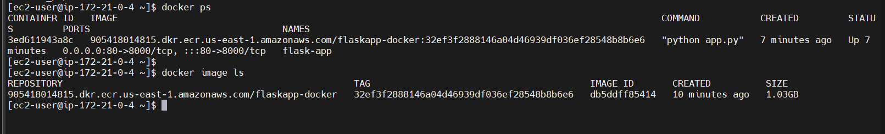
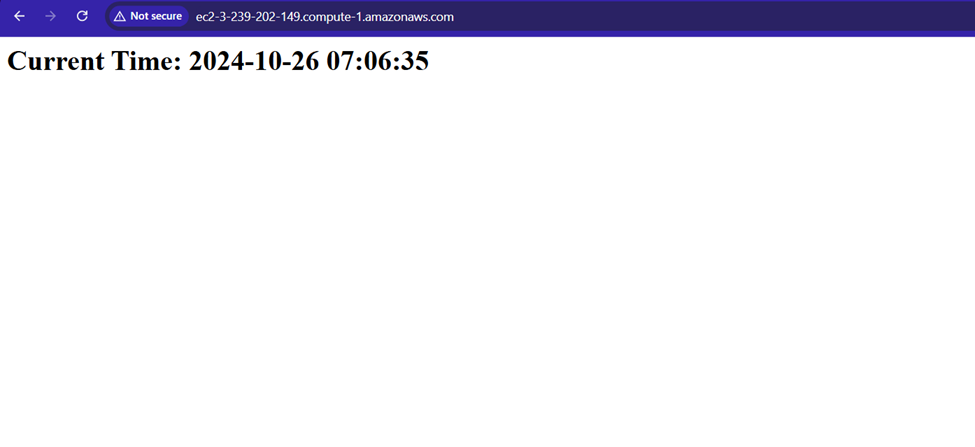

Building AWS infrasturcture using Terraform and utilizing CICD via Github Actions to deploy a dockerized Flask app within an ec2 instance.

WHAT HAS BEEN DONE:
----------------------
1. Created AWS infrastructure using terraform. This includes:
- a VPC
- a public subnet
- an internet gateway
- route table and its association for internet connection
- an ec2 instance
- a security group to attach to the instance
- IAM roles and instance profile for the ec2 instance
- an ECR repository to store the docker image within ec2 instance

2. Wrote a simple Flask application code

3. Created a Dockerfile to package the Flask application and its dependencies

4. Created the GitHub Action Workflow to build and deploy the flask application

Result:

Docker container running within the ec2 instance:

Flask application running at port 80:

